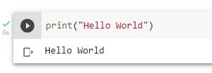

## Hello World

The first program you will experience as a programmer learning a new language is the _Hello World Program_.

```python3
print("Hello World")
```

which displays

```
>> Hello World
```

## Run it!

[Open our Colab notebook](https://colab.research.google.com/drive/1d53eHcuzkVFdg7OldKUdAe2-hgjU6OA6?usp=sharing) to run this program for yourself. Press the play button, to the left of the code block, to run the program. After pressing the play button, you should see the program run and produce an output, like this:



## Modify it!

Change the program to print _Hello Matt_ instead of _Hello World_.
Run your program to prove that it works.

## Modify it again!

Change your program to print _Hello World_ and _Hello Matt_ by duplicating the line of code to have two print statements.

```python3
print("Hello World")
print("Hello Matt")
```

Run your program to show that it works! You should see

```
>> Hello World
>> Hello Matt
```

## Congratulations

You've just ran your first program and modified it to accomplish a task. We'll be building on this simple example with more, 2 minute exercises, to increase your confidence.
