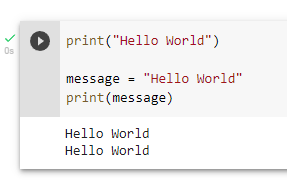

## Variables

Using the first _Hello World Program_ that you made, we will introduce the concept of variables.

> A variable is a named item used to hold a value.

Consider these variables, which hold text values:

```python3
name = "Matt"
otherName = "Barbara"
```

Alternatively, variables can hold number values

```python3
age = 27
hoursInADay = 24
```

A variable can be substituted where we used `"Hello World"` in the original program.

```python3
print("Hello World")

message = "Hello World"
print(message)
```

Which prints:

```
>> Hello World
>> Hello World
```

## Run it!

[Open our Colab notebook](https://colab.research.google.com/drive/11dCzzMtvXhR7zVzfs9sRJlzds85qsZlk?usp=sharing) to run this program for yourself. Press the play button, to the left of the code block, to run the program. After pressing the play button, you should see the program run and produce an output, like this:



## Modify it!

Change the value of the variable from "Hello World" to some other text value (called a string in Python). Run the program to see that it now prints Hello World and your new text.

## Modify it again!

We can form a more interesting, complete program with a little more effort.

Change your program to have 3 variables, `messageStart`, `messageBody`, `messageEnd` with the values `"Hi there."`, `"I hope you are having a great day today!"`, and `"I will see you tomorrow."`. Then print each of these variables out, like we did previously in this exercise.

Run your program to show that it works! You should see

```
>> Hi there.
>> I hope you are having a great day today!
>> I will see you tomorrow.
```

### Check against our solution:

Here is an example program we wrote to do just this. The ordering of your print statements and variables may be slightly different, but produces the same output.

```python3
messageStart = "Hi there."
messageBody = "I hope you are having a great day today!"
messageEnd = "I will see you tomorrow."
print(messageStart)
print(messageBody)
print(messageEnd)
```

## Congratulations

You've just finished your second program and modified it to accomplish a task. You know a little bit about variables now, which we will teach more about in the next lesson. Variables will be used frequently in future exercises, so take the time to understand them.
